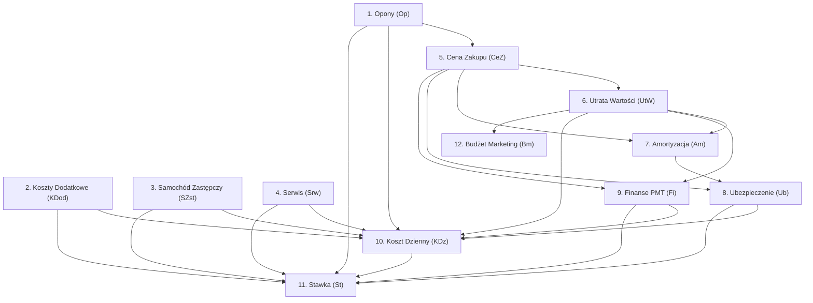

# V1 CalcReport — Referencja logiki 12 sub-kalkulatorów

> Każda sekcja opisuje **dokładnie** co robi kod C# V1 z numerami linii.
> ⏸ = Czekam na Twoją decyzję: "Tak samo w V3" / "Inaczej, bo..." / "Pytanie"

---

## 1. OPONY `(Op)` — [LTRSubCalculatorOpony.cs](file:///C:/Users/proma/Downloads/kalkulator_V1_extracted/kalkulator_V1/LTRSubCalculatorOpony.cs)

### Wejścia

| Param                                    | Źródło                                      | Linia            |
| ---------------------------------------- | ------------------------------------------- | ---------------- |
| `ZOponami`                               | Kalkulacja (bool)                           | L46              |
| `KlasaOpon`                              | Kalkulacja (string, np. "WIELOSEZONOWE...") | L30              |
| `RozmiarOpon.Srednica`                   | Kalkulacja                                  | L104, L122, L128 |
| `Okres` (miesiące)                       | LTRTabele                                   | L32              |
| `Przebieg` (km)                          | LTRTabele                                   | L85, L157-L182   |
| `AutoLiczbaOpon` / `LiczbaKompletowOpon` | Kalkulacja                                  | L150-L153        |
| `KorektaKosztuOpon` / `KosztOponKorekta` | Kalkulacja                                  | L136-L137        |
| `OdkupOpon`                              | Kalkulacja (bool)                           | L100-L102        |

### Logika (co robi)

1. **Koszt 1 kompletu** (L117-L141): Pobiera cenę z `PozycjaCennikaOpon` dla danej `Srednica` + `KlasaOpon` + marka "Budżet". Opcjonalnie dodaje korektę (`KosztOponKorekta / VAT`).
2. **Ilość kompletów na kontrakt** (L143-L183): Schodkowa tablica: `wielosezonowe` → progi co 60k km (1-6 kompletów), `sezonowe` → progi 120k/180k/240k/300k (1-5).
3. **Łączny koszt opon** (L185-L220): Jeśli `AutoLiczbaOpon=false` → `ilość × cena`. Jeśli auto → `wielosezonowe`: `cena + ((przebieg - 60k) / 60k) × cena`; `sezonowe`: `cena + ((przebieg - 120k) / 60k) × cena`.
4. **Przekładki** (L80-L88): `wielosezonowe` → `ceil(przebieg / 60k) × cenaPrzekladki`; `sezonowe` → `cenaPrzekladki × lata × 2`.
5. **Przechowywanie** (L90-L96): `wielosezonowe` → 0; `sezonowe` → `kosztPrzechowywania × lata × 2`.
6. **Odkup opon** (L98-L115): Pobiera wartość odkupu z cennika (marka="Odkup opon"), odejmuje od sumy.
7. **Wynik** (L53): `OponyNetto = lacznyKosztOpon + cenaPrzekladki + przechowywanie - odkup`

### CalcReport (co wypisuje w raporcie)

```
iloscOponNaKontrakt, koszt1kompletu, lacznyKosztOpon,
cenaPrzekladki, przechowywanieOpon, odkupOpon,
opony (= OponyNetto) ← SUMA KOŃCOWA
```

### Wynik przekazywany dalej

| Pole            | Używane w...                                                    |
| --------------- | --------------------------------------------------------------- |
| `Koszt1KplOpon` | → **(CeZ)** Cena Zakupu (L287): dodane do CAPEX brutto          |
| `OponyNetto`    | → **(KDz)** Koszt Dzienny (L365): składnik kosztów technicznych |
| `IloscOpon`     | → Raport końcowy                                                |

### ⏸ **Twoja decyzja dla V3:**

_Czy V3 ma działać tak samo? Czy odkup opon jest potrzebny? Czy cennik opon z bazy external (PozycjaCennikaOpon) zastępujemy naszą tabelą `koszty_opon`?_

---

## 2. KOSZTY DODATKOWE `(KDod)` — [LTRSubCalculatorKosztyDodatkowe.cs](file:///C:/Users/proma/Downloads/kalkulator_V1_extracted/kalkulator_V1/LTRSubCalculatorKosztyDodatkowe.cs)

### Logika

1. **Abonament GSM** (L70-L88): Jeśli `CzyGPS=true` → `abonament × okres + cenaUrządzenia / 6 × okres / 12 + montaż`.
2. **Przygotowanie do sprzedaży** (L129-L152): Dla LTR → `korektaKlasa × korektaPrzebieg × PrzygotowanieDoSprzedazyLtr`. Dla innych → `PrzygotowanieDoSprzedazyRacMtr`.
3. **Rejestracja/karta pojazdu** (L32): Stała z parametrów `ZarejestrowanieKartaPojazdu`.
4. **Elementy ryczałtowe** (L91-L106): Suma stawek miesięcznych × okres LUB stawek za 10tys km × (przebieg / 10k).
5. **Koszty zabudowy** (L108-L127): `(okres / 12) × KosztyDodatkoweNettoRok` — z tabeli `KosztZabudowy` wg klasy i typu zabudowy.
6. **Demontaż kraty** (L36-L39): Stała z parametrów, jeśli `isDemontaz=true`.
7. **Hak holowniczy** (L41-L44): Stała z parametrów, jeśli `Hak=true`.

### CalcReport

```
przygotowanieDoSprzedazyLtr, rejestracjaKartaPojazdu, hakHolowniczy,
demontazKraty, abonamentGSM, elementyRyczaltowe, kosztyDodatkoweZabudowy,
kosztyDodatkowe ← SUMA
```

### Wynik

| `KosztyDodatkowe` | → **(KDz)** + **(St)** |

### ⏸ **Twoja decyzja:**

_Które z tych pozycji są potrzebne w V3? Elementy ryczałtowe? Koszty zabudowy? Korekta klasa/przebieg dla przygotowania do sprzedaży?_

---

## 3. SAMOCHÓD ZASTĘPCZY `(SZst)` — [LTRSubCalculatorSamochodZastepczy.cs](file:///C:/Users/proma/Downloads/kalkulator_V1_extracted/kalkulator_V1/LTRSubCalculatorSamochodZastepczy.cs)

### Logika (L28-L93)

1. Jeśli `SamochodZastepczy=false` → `stawka = 0`.
2. Pobiera `klasaId` z modelu.
3. Szuka `LTRAdminStawkaZastepczy` wg `klasaId`.
4. **Formuła** (L64): `stawka = SredniaIloscDobWRoku × DobaNetto × okres / 12`

### CalcReport

```
klasaId, klasa, sredniaIloscDobWRoku, dobaNetto, okresUzytkowania,
stawkaZaZastepczy ← WYNIK
```

### Wynik

| `StawkaZaZastepczyNetto` | → **(KDz)** + **(St)** |

### ⏸ **Twoja decyzja:**

_V3 pobiera stawkę z tabeli `insurance_samochody_zastepcze_kategorie`. Czy formuła ta sama?_

---

## 4. SERWIS `(Srw)` — [LTRSubCalculatorSerwis.cs](file:///C:/Users/proma/Downloads/kalkulator_V1_extracted/kalkulator_V1/LTRSubCalculatorSerwis.cs)

### Logika

1. **Tabela serwisowa** (L161-L221): Pobiera pozycje z `TabelaSerwisowa` (przebieg → kwota serwisu). Oblicza proporcjonalnie koszt na zakresie Overlap(przebiegStart, przebiegKoncowy).
2. **Przeglądy podstawowe** (L229-L244): Jeśli `iloscPrzegladow < wynajemWLatach` → dosztukuje brakujące przeglądy kosztem stałym (`KosztPrzegladuPodstawowego`).
3. **Korekta admin %** (L54): Tylko dla LTR: `kosztyLaczne × KorektaSerwisProcent`.
4. **Pakiet serwisowy** (L56-L60): Jeśli `pakietSerwisowyNetto > 0` → wynik = `pakietSerwisowyNetto + inneKosztySerwisowania`.
5. **Wynik końcowy** (L246-L273): Jeśli `CzyUwzgledniaSerwisowanie=false` → 0. Jeśli pakiet → pakiet+inne. Inaczej → koszty z przebiegu + inne - korekta admin.

### CalcReport

```
sumaZKosztowPrzebiegu, wynajemWLatach, iloscPrzegladowZPrzebiegu,
inneKosztySerwisowaniaNetto, kosztyLaczneZPrzebiegiemPodstawowym,
korektaAdminProcent, pakietSerwisowyKorektaKosztow,
kosztyLacznie ← WYNIK
```

### Wynik

| `SerwisNetto` | → **(KDz)** + **(St)** |

### ⏸ **Twoja decyzja:**

_V3 używa `LTRSubCalculatorSerwisNew.py` — inny algorytm. Czy to celowe odejście od V1?_

---

## 5. CENA ZAKUPU `(CeZ)` — [LTRSubCalculatorCenaZakupu.cs](file:///C:/Users/proma/Downloads/kalkulator_V1_extracted/kalkulator_V1/LTRSubCalculatorCenaZakupu.cs)

### Logika (wartości BRUTTO → wynik w NETTO)

1. `opcjeFabryczneSuma` = suma cen fabr. opcji (L47)
2. `cenaCatalogue` = CenaCennikowa + opcjeFabryczne (L48)
3. Rabat (L52-L59): `(cenaCatalogue - transport - nierabatowane) × (1 - rabat%) + transport + nierabatowane`
4. `opcjeSerwisowe` (L111-L131): suma opcji serwisowych + jeśli GPS → `cenaGSM + montażGSM` (netto→brutto)
5. `cenaZa1KompletOpon` = `Koszt1KplOpon × VAT` (brutto) (L65)
6. **CenaZakupu** (L69-L72): `po rabacie + opcjeSerwisowe + opony + pakietSerwisowy`
7. Wynik (L100-L107): Wszystko dzielone przez VAT → netto

### CalcReport

```
opcjeFabryczneSuma, cenaKatalogowaZOpcjamiFabrycznymi, oplataTransportowa,
opcjeKatalogoweNierabatowane, cenaKatalogowaPoRabacie, rabatKwotowo,
opcjeSerwisowe, cenaZa1KompletOpon, pakietSerwisowy,
cenaSamochoduZOponamiIOpcjamiSerwisowymiIPakiet ← WYNIK BRUTTO
cenaSamochoduBezOpon, cenaSamochoduBezOponIOpcjiSerwisowych,
cenaSamochoduBezOpon_OpcjiSerwisowych_iPakietu
```

### Wynik (NETTO = brutto / VAT)

| `CenaZakupu` | → **(Am)** WP, **(Ub)** CenaZakupu, **(Fi)** WartoscPoczatkowa |
| `CenaSamochoduBezOpon_OpcjiSerwisowych_iPakietuNetto` | → **(UtW)** jako baza WR |

### ⏸ **Twoja decyzja:**

_Jak V3 liczy CAPEX? Czy formuła rabatowania jest taka sama?_

---

## 6. UTRATA WARTOŚCI `(UtW)` — [LTRSubCalculatorUtrataWartosci.cs](file:///C:/Users/proma/Downloads/kalkulator_V1_extracted/kalkulator_V1/LTRSubCalculatorUtrataWartosci.cs) (544 linii — NAJKOMPLEKSOWSZY)

### Logika

1. **Cena używanego** (L257-L323 / L148-L255): Interpolacja z TabelaEurotax. Rocznik bieżący → `GetCenaUzywanego()`. Rocznik poprzedni → `GetCenaUzywanegoMinus1()` (średnia 2 sąsiednich albo ekstrapolacja).
2. **Cena używanego bez korekty** (L50-L53): `cenaUzywanego(okres) / cenaUzywanego(0) × cenaCennikowaNetto`
3. **WR dla wyposażenia** (L59-L60): `(opcjeFabr + opcjeSerw) / (1 + okres/12) × (1 + miesiacStart/12)`
4. **Przebieg normatywny** (L448-L500): Z tabeli `LTRPrzebiegNormatywny` wg symbolEurotax.
5. **Korekta za przebieg** (L384-L446): Matryca 4 ćwiartek (`nadprzebieg/niedobieg` × `<100k/>100k`) → mnożnik z `LTRKorektaEtax`. Formuła: `cenaUzywanego × korekta × (nadprzebieg / 100k)`.
6. **Korekta administracyjna** (L325-L382): `naukaJazdy + brakMetalika + kombi` (% od WR).
7. **Korekta RV dla LTR** (L503-L524): Z tabeli `WRLTR` wg `klasa - paliwo`.
8. **WR końcowe** (L526-L540): `WR × (1 - korektaAdmin) + korektaRV_LTR`. Jeśli bez serwisu → dodatkowy mnożnik.
9. **Utrata wartości** (L83-L96): `CAPEX(bezOpon..) + sumaOpcji - WR`. Z czynszem: `max(0, UtrataWartości - czynsz)`.

### CalcReport

```
cenaCennikowaNetto, cenaUzywanegoBezKorekty, doposazenieFabr, doposazenieSerw,
WRdlaWyposazenia, przebiegNormatywny, nadprzebiegNiedobieg, korektaZaPrzebiegPLN,
WRpoKorekcieZaPrzebieg, korektaAdmin%, korektaAdminKwotowo,
WRPrzewidywanaCenaSprzedazy ← WYNIK WR
utrataWartosci, utrataWartosciZczynszemInicjalnym
```

### Wynik

| `WR` | → **(Am)**, **(Fi)** wykup, **(Bm)** |
| `UtrataWartosciBEZczynszu` | → **(KDz)** symulacja |
| `UtrataWartosciZCzynszemInicjalnym` | → **(KDz)** główna, **(St)** |

### ⏸ **Twoja decyzja:**

_V3 używa SAMAR zamiast EurotaxTable. Jak mapujemy korekty (przebieg, admin, LTR)?_

---

## 7. AMORTYZACJA `(Am)` — [LTRSubCalculatorAmortyzacja.cs](file:///C:/Users/proma/Downloads/kalkulator_V1_extracted/kalkulator_V1/LTRSubCalculatorAmortyzacja.cs) (53 linie — PROSTY)

### Logika (L26-L48)

```
utrataWartosci = WP - WR
kwotaAmortyzacji1Miesiac = utrataWartosci / Okres
procentAmortyzacji = kwotaAmortyzacji1Miesiac / WP
```

### CalcReport

```
WP, WR, utrataWartosci, kwotaAmortyzacji1Miesiac, procentAmortyzacji
```

### Wynik

| `AmortyzacjaProcent` | → **(Ub)** do naliczania składki AC |

### ⏸ **Twoja decyzja:**

_Prosty wzór. V3 powinien być identyczny?_

---

## 8. UBEZPIECZENIE `(Ub)` — [LTRSubCalculatorUbezpieczenie.cs](file:///C:/Users/proma/Downloads/kalkulator_V1_extracted/kalkulator_V1/LTRSubCalculatorUbezpieczenie.cs)

### Logika — PĘTLA 7 LAT (L12: `LICZBA_LAT = 7`)

Dla każdego roku r=1..7 (L64-L107):

1. **Podstawa naliczania** (L79): `CenaZakupu × (1 - (r-1)×12 × amortyzacja%)`
2. **Składka AC** (L82): `round(stawkaBazowaAC × podstawa)`
3. **Składka OC** (L83): z tabeli `LTRAdminUbezpieczenie` (stała roczna)
4. **Doubezpieczenia** (L85-L86): `składkaAC × %kradzież`, `składkaAC × %naukaJazdy`
5. **Składka roczna** (L150-L184): Suma powyższych, skalowana proporcjonalnie do okresu (jeśli okres nie wypada na pełny rok).
6. **Szkodowość roczna** (L240-L265): `sredniaWartoscSzkody / okres × (ilosc miesięcy w danym roku)`. Gdzie `sredniaWartoscSzkody` = `SredniaWartoscSzkody × (przebieg / srPrzebiegSzkody × wspSrPrzebieg × wspWartoscSzkody)` (L233-L234).
7. **Składka łącznie** (L93): `składkaRoczna + szkodowość`
8. **Suma** (L109-L116): `sum(skladkaLacznie)` + opcjonalnie korekta kosztów ubezp.

### CalcReport (tabela 7-kolumnowa)

```
PostawaNaliczania[1..7], SkladkaBazowaAC[1..7], SkladkaAC[1..7],
SkladkaOC[1..7], DoubezpKradziezy[1..7], DoubezpNaukaJazdy[1..7],
SkladkaRoczna[1..7], SredniaWartoscSzkody[1..7], SkladkaLacznie[1..7],
SkladkaWCalymOkresie[1..7]
```

### Wynik

| `SkladkaWCalymOkresieNetto` | → **(KDz)** + **(St)** |

### ⏸ **Twoja decyzja:**

_Pętla 7-letnia MUSI zostać. Czy stawki AC/OC/szkodowość pobieramy z tych samych tabel w V3?_

---

## 9. FINANSE (PMT) `(Fi)` — [LTRSubCalculatorFinanse.cs](file:///C:/Users/proma/Downloads/kalkulator_V1_extracted/kalkulator_V1/LTRSubCalculatorFinanse.cs) + [PMT.cs](file:///C:/Users/proma/Downloads/kalkulator_V1_extracted/kalkulator_V1/PMT.cs)

### Logika

1. **Wartość kredytu** (L61): `WP - (CzynszInicjalny / VAT)`
2. **Kwota wykupu** (L63): `min(wartośćKredytu, WR)`
3. **Oprocentowanie** (L67): `WIBOR + MarzaFinansowa`
4. **PMT** (PMT.cs L15-L38): `pmt = ((kapital × (1+im)^n + wykup) × im) / (1 - (1+im)^n)` gdzie `im = oprocentowanie / 12`
5. **Harmonogram rat** (L138-L188): Pętla po miesiącach, oblicza ratę odsetkową, kapitałową, kapitał po spłacie.
6. **Dwa warianty**: `zCzynszem` (kredyt = WP - czynsz) i `bezCzynszu` (kredyt = WP).

### CalcReport

```
WartoscPoczatkowaNetto, wartoscKredytu, czynszInicjalnyProcent,
wykupProcent, wykupKwota, iloscRat, wibor, marzaFinansowa, oprocentowanie,
[tabela rat: KapitalDoSplaty, RataLeas, RataKap, KapitalPoSplacie, RataOdsetkowa]
Suma odsetek z czynszem / bez czynszu
```

### Wynik

| `SumaOdsetekZczynszem` | → **(KDz)** KosztFinansowy |
| `SumaOdsetekBEZczynszu` | → **(KDz)** symulacja |
| `CzynszInicjalnyNetto` | → Raport |

### ⏸ **Twoja decyzja:**

_Czy formuła PMT w V3 jest identyczna? Czy WIBOR/margin jest z bazy czy inputu?_

---

## 10. KOSZT DZIENNY `(KDz)` — [LTRSubCalculatorKosztDzienny.cs](file:///C:/Users/proma/Downloads/kalkulator_V1_extracted/kalkulator_V1/LTRSubCalculatorKosztDzienny.cs) (91 linii — PROSTY)

### Logika (L43-L84)

```
lacznyKosztFinansowy = KosztFinansowy(odsetki z czynszem) + UtrataWartości(z czynszem)
lacznyKosztTechniczny = Zastępczy + Dodatkowe + Ubezpieczenie + Opony + Serwis
kosztyOgolem = fin + tech
kosztyMiesiac = kosztyOgolem / Okres
kosztDzienny = kosztyMiesiac / 30.4
```

Plus symulacja BEZ czynszu (L59-L62).

### CalcReport (tabela 2-kolumnowa: NETTO / BEZ_CZ)

```
lacznyKosztFinansowy, lacznyKosztTechniczny, kosztyOgolem, kosztyMiesiac, kosztDzienny
```

### Wynik

| `KosztMC`, `KosztMcBEZcz` | → **(St)** |
| `KosztDzienny`, `KosztyOgolem` | → Raport |

### ⏸ Stała `COEFF_KOSZT_DZIENNY = 30.4` (L10)

---

## 11. STAWKA `(St)` — [LTRSubCalculatorStawka.cs](file:///C:/Users/proma/Downloads/kalkulator_V1_extracted/kalkulator_V1/LTRSubCalculatorStawka.cs) (311 linii — ZŁOŻONY)

### Logika

1. **Podstawa marży** (L94-L101): Jeśli `czynsz = 0` → `KosztMC`; inaczej → `KosztMcBEZcz`.
2. **Marża MC** (L103): `podstawaMarzy × (1/(1-marza%)) - podstawaMarzy`
3. **Rozkład marży** — dla 6 grup kosztów (Finansowy, Ubezpieczenie, Zastępczy, Serwis, Opony, Admin): każdy ma 8 pól (`KosztyLaczne, KosztMC, RozkladMarzy, RozkladMarzyKorekta, KwotaMarzy, KwotaMarzyKorekta, KosztPlusMarza, KosztPlusMarzaKorekta`).
4. **Czynsz finansowy** (L177): `kosztFinansowy.KosztPlusMarzaKorekta`
5. **Czynsz techniczny** (L178-L182): Suma `KosztPlusMarzaKorekta` wszytkich tech.
6. **Oferowana stawka** (L184): `czynszFinansowy + czynszTechniczny`

### CalcReport

```
[tabela rozkładu marży dla 6 grup kosztów]
Czynsz finansowy, Czynsz techniczny, Ubezpieczenie, Zastępczy, Serwis, Opony, Koszty dodatkowe
marzaMC, marzaNaKontrakcie, marzaNaKontrakcieProcent, przychod
```

### Wynik

| `OferowanaStawka` | → **Wynik końcowy** (zaokrąglona do pełnych PLN w LTRKalkulator.cs L407) |
| `CzynszFinansowy`, `CzynszTechniczny` | → Raport |
| `MarzaMC`, `MarzaNaKontrakcie` | → Raport |

### ⏸ **Twoja decyzja:**

_V3 ma uproszczoną wersję bez rozkładu marży (KosztPlusMarzaKorekta). Czy potrzebujemy pełny rozkład z ręcznym podziałem?_

---

## 12. BUDŻET MARKETINGOWY `(Bm)` — [LTRSubCalculatorBudzetMarketingowy.cs](file:///C:/Users/proma/Downloads/kalkulator_V1_extracted/kalkulator_V1/LTRSubCalculatorBudzetMarketingowy.cs) (46 linii — NAJPROSTSZY)

### Logika (L28)

```
korektaWRMaksBrutto = WR × StawkaVAT × BudzetMarketingowyLtr
```

### CalcReport

```
korektaWRMaksBrutto ← WYNIK
```

### Wynik

| `KorektaWRMaks` | → Raport końcowy |

### ⏸ _Prosty wzór. V3 powinien być identyczny?_

---

## PODSUMOWANIE: Łańcuch zależności (flow z `LTRKalkulator.cs` L237-L399)


